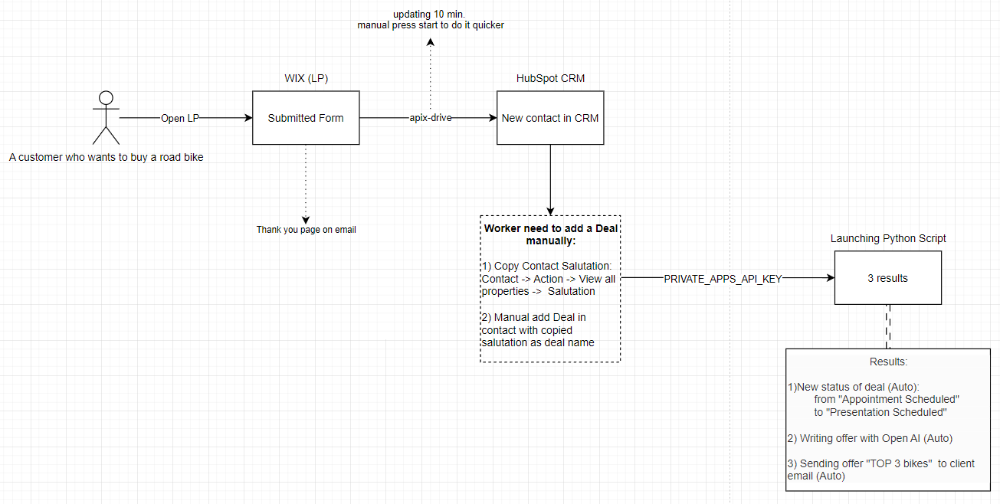
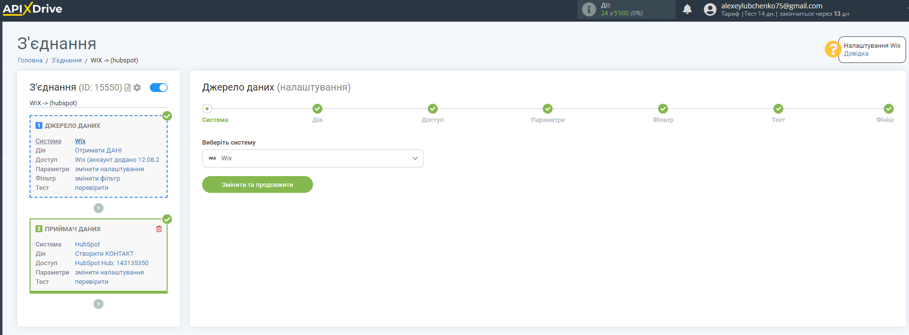
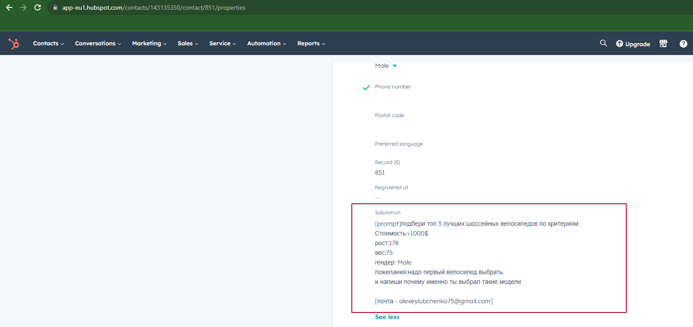
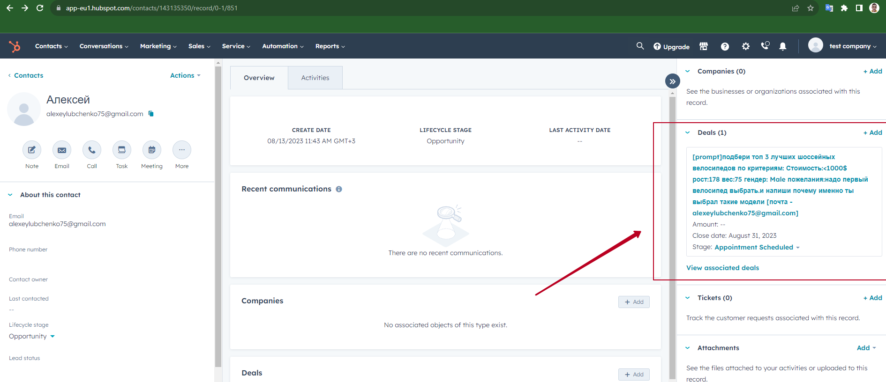

# HubSpot_WIX_OpenAI 
# Test task:

Взять любой web builder (Tilda, Wix ...).
Сделать простой LP с формой (критерии придумать) для подбора моделей велосипеда. 
Форма: имя, *критеии*, почта, сабмит.

После отправленной формы должно прийти сообщение 'Спасибо' на почту.

Должен появиться лид в HubSpot CRM со статусом 'Лид'.
Проверить лида, если все ок, то перевести руками Лид в Сделку.

Open AI должен сформировать коммерческое предложение с характеристиками основных моделей.
Prompt для Chat GPT придумать самому.
В результате клиенту должно прийти на почту коммерческое предложение.

Дедлайн 14.08 вечер.

# Implementation:

1) WIX LP - https://alexeylubchenko75.wixsite.com/mysite
2) Интеграция лидов в контакт настроена через apix-drive через веб-хук 
3) Сообщение "Спасибо" после заполненной формы настроено через триггер WIX
4) На вкладке контакты в HubSpot в течение 10 минут (или если на apix-drive вручную включить обновление)
появиться лид с заполненными полями формы. Сырой Prompt для генерации емейла записан в Contact -> Action -> View all properties -> Salutation 
5) После этого сейлз проверяет контакт вручную должен создать сделку *обязательно указав в deal name все содержимое Salutation * 
6) Указать в .env_sample все ключи доступа, почту пароли и тд.
7) Изменить имя ".env_sample" на ".env"
8) Установить $ pip install -r requirements.txt
9) Запустить main.py (1 сообщение будет генерировать приблизительно секунд 10-15)

В результате  будет:

9.1) Изменен статус сделки с "Appointment Scheduled" на "Presentation Scheduled"  
9.2) Сгенерировано коммерческое предложение через open AI  
9.3) Отправлено КП на почту клиенту, который заполнил форму 

# Pay attention:
Нужно установить requirements.txt: 
#### $ pip install -r requirements.txt

Для корректной работы скрипта надо установить все значения в ".env_sample" и изменить название на ".env".